# Crab game
2D mobile game with funny graphic and responsive physics using SpriteKit framework, also integrated with GameCenter. I developed this game last summer to pursue my passion in mobile apps development and game design. I use xcode as my project management and objective-c as my primary language. Some extension that I planned to do are:
* Recorded my own sound effects and background music
* Better memory management and maximizing performance while minimizing space
* More fluid and smooth movement of character and player feedback
* Upgraded levels, weapons, and costume
* Combo for 

# Gameplay
the objective is to get as much point before you get caught and killed by your enemies
###### Start page

###### In game
the objective is to get as much point before you get caught and killed by your enemies
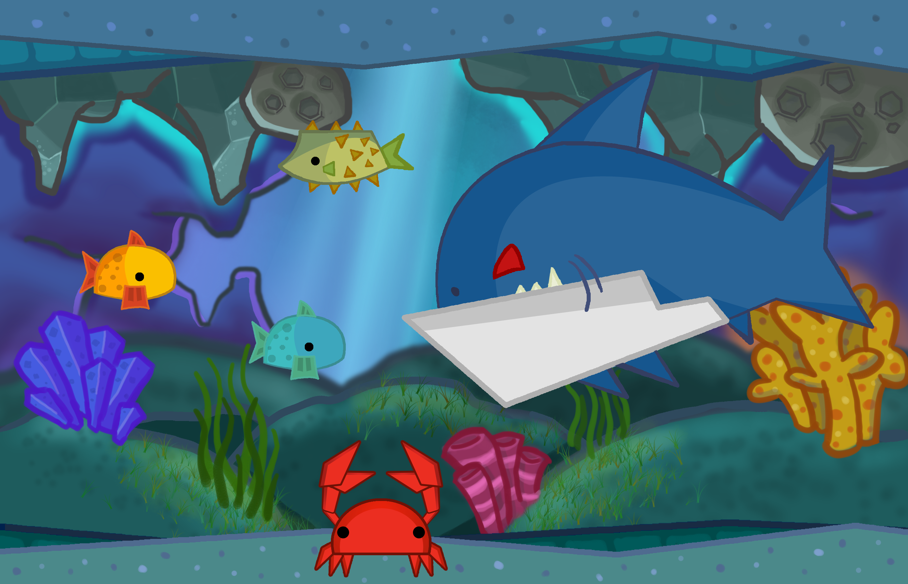
###### Game over
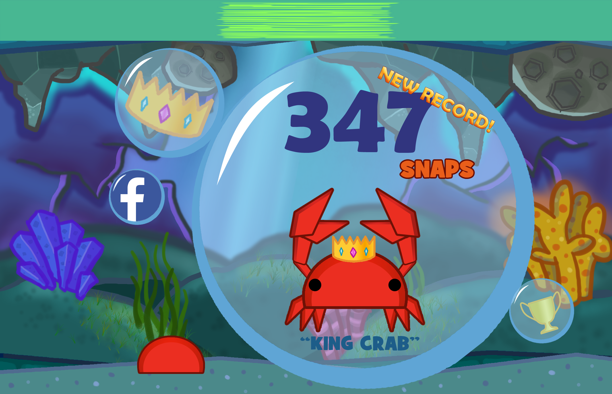

# Characters
## Crab
##### as the main character of this game
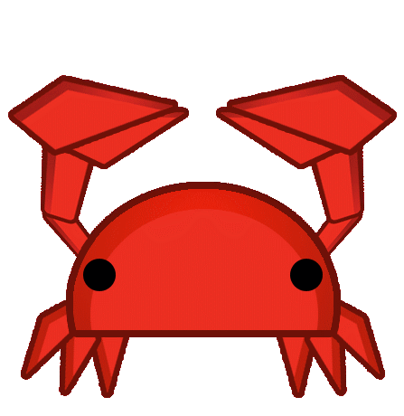
## Enemies
##### Giant and hungry sharks are wondering around the ocean to eat you
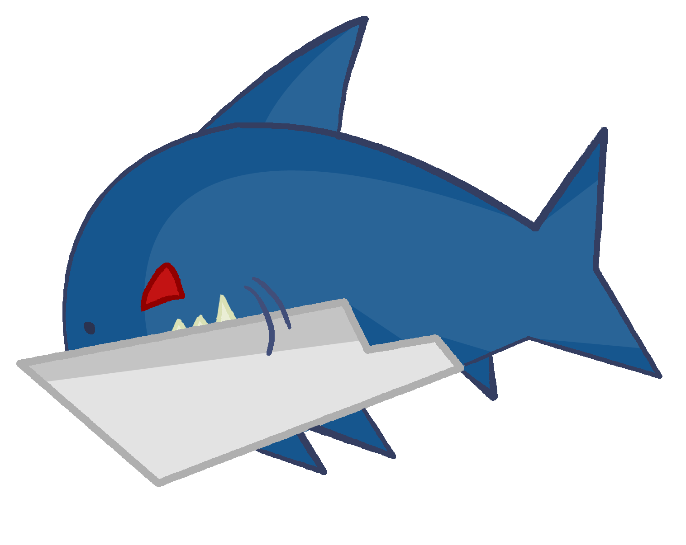
##### A spiky fish worth 2 points unless it bloats and snap your shell
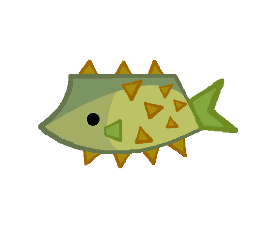

## Food Fish
##### purple fish
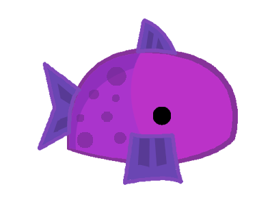
##### yellow fish
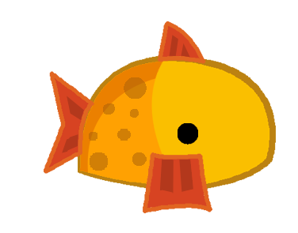
##### green fish
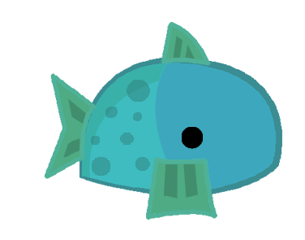
## Achievements
##### showed on the game over screen according to player's points
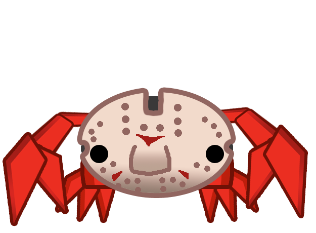

# Marketing Design
## Logo
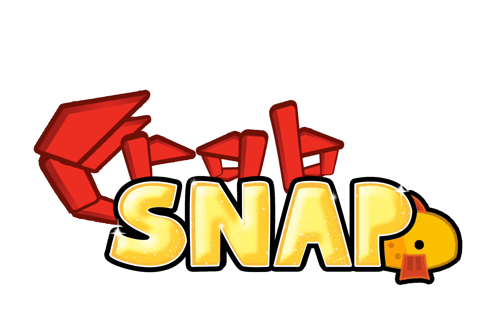
## Icons
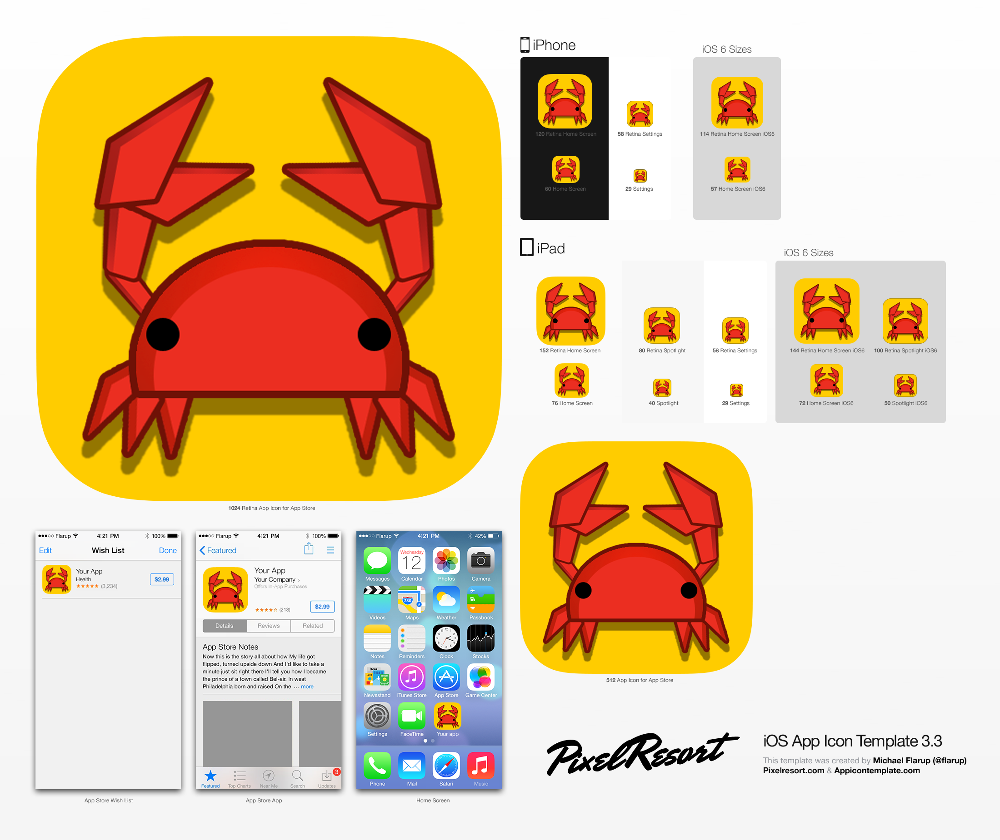